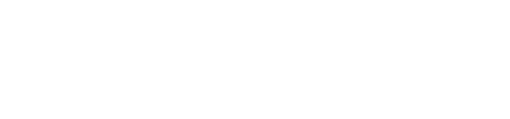

  <!-- Top Animated Banner (Transparent Background, Clean Typography) -->
  

  

    
    
    
    
  

---

### 🌟 About Me

- 🕶️ **Vibe Code LARPER** — Blending instinctive vibe-driven coding with a strong curiosity for cutting-edge tech.
- 📐 **Deeply Obsessed with Mathematics** — Passionate about the elegant math behind everything: Linear Algebra, Multivariable Calculus, Probability Theory, and Optimization that form the bedrock of AI.
- 🤖 **Passionate about Machine Learning** — Fascinated by understanding how mathematical equations translate into intelligent models and neural networks.
- 📚 **Continuous Learner** — *Masih sangat butuh dan aktif dalam proses pembelajaran seputar Machine Learning, AI, dan matematika lanjut* (actively mastering algorithms, proofs, and model architectures).
- 💻 **Modern Web Craft** — Building responsive, interactive web interfaces with TypeScript, React, and Tailwind CSS.

---

### 📐 Math & Theory Obsessions

> *"Mathematics is the language of the universe — and the true engine behind every machine learning algorithm."*

- 🔷 **Linear Algebra**: Matrix Decompositions (SVD, Eigenvalues & Eigenvectors), Vector Spaces, Tensor Transformations
- 📈 **Calculus & Optimization**: Gradient Descent dynamics, Loss Landscapes, Jacobians & Hessians, Convex Optimization
- 🎲 **Probability & Statistics**: Bayesian Inference, Probability Distributions, Maximum Likelihood Estimation (MLE), Markov Chains
- 🔬 **Information Theory**: Entropy, Cross-Entropy, KL Divergence, Latent Space Representations

---

### 🛠️ Languages and Tools:

  

---

### 🧠 Current Learning Journey (Machine Learning & AI)

> *"Setiap hari adalah proses belajar untuk memperdalam pemahaman seputar Machine Learning & Artificial Intelligence."*

- 📐 **Foundations**: Deep-diving into Linear Algebra, Calculus, Probability, & Statistics for ML
- 🐍 **Data Manipulation**: Feature Engineering & Preprocessing with `pandas` & `numpy`
- ⚙️ **Classical ML**: Supervised & Unsupervised Learning with `scikit-learn`
- 🔥 **Deep Learning**: Neural Network architectures with `PyTorch` and `TensorFlow`
- 🤖 **Modern AI & LLMs**: Fine-tuning, RAG, and AI Agent workflows
- 🚀 **Integration**: Deploying ML pipelines with modern frontend interfaces (React + Tailwind)

---

  <!-- Bottom Animated Banner (Transparent Background) -->
  

  ✨ <i>"Code with intuition, learn with conviction, let math & vibes guide the model."</i> — <b>Roxy Mayford</b>

